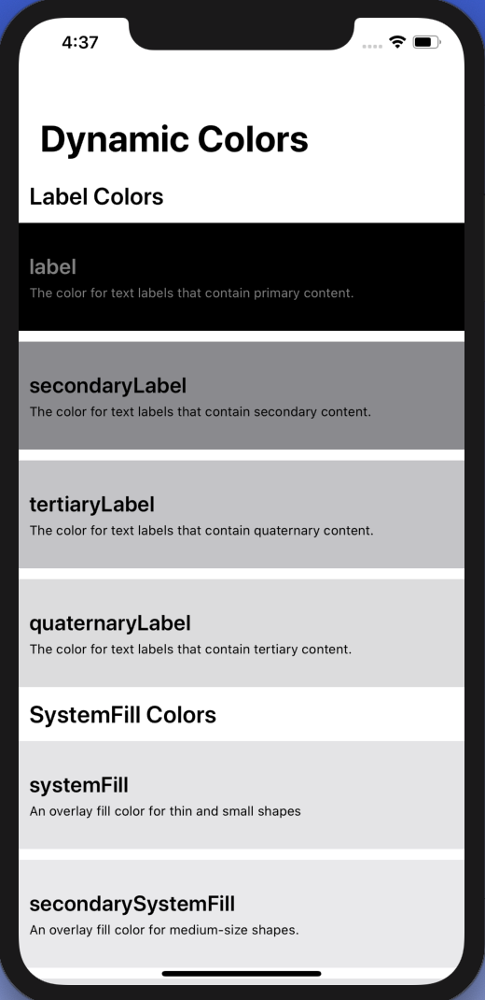

# iOS 13 Dynamic System Colors

In iOS 13 Apple introduced the dynamic system color scheme to for easy implementation of dark mode. This app presents the colors in a collection view for reference by designers and developers.  

### Prerequisites

iOS 13.0+
Swift 5+
Xcode 11+

## Versioning

1.0

## Authors

* **Arturo Arriaga** - *Initial work* - [ArturoArriaga](https://github.com/ArturoArriaga)

## License

This project is licensed under the MIT License - see the [LICENSE.md](LICENSE.md) file for details

